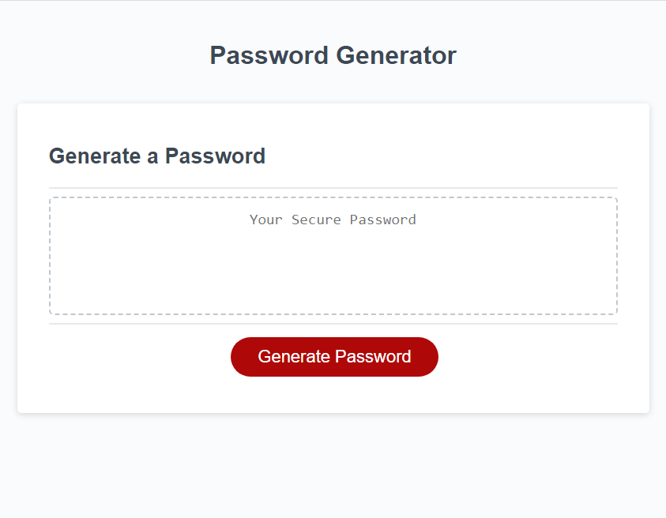

# Random Password Generator

## Description

- The purpose of this project was to make a working random password generator.
- I built this project in order to make JavaScript code that would make the random password generator work.
- The  code solves the problem of making the password generator create a password based on user input.
- I learned how functions and variables are used to make a webpage interactive.

## Installation

N/A

## Usage

This website generates random passwords based on user input.

## Credits

N/A

## License

Please refer to the license in the repo.

